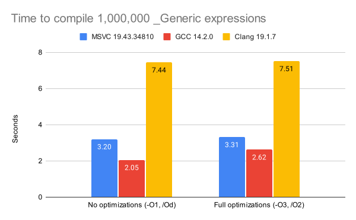

# `_Generic` Compile Speed Benchmark

This repository contains a small benchmark of the speed at which GCC, Clang, and MSVC handle `_Generic` expressions in C at various optimization settings.

The test file uses the preprocessor to generate 1,000,000 `_Generic` expressions, each containing 24 branches:

```c
  #define X                                              \
  (void)_Generic( foo,                                   \
    unsigned char: handle_unsigned_char,                 \
    signed char: handle_signed_char,                     \
    unsigned short: handle_unsigned_short,               \
    short: handle_short,                                 \
    unsigned int: handle_unsigned_int,                   \
    int: handle_int,                                     \
    unsigned long: handle_unsigned_long,                 \
    long: handle_long,                                   \
    unsigned long long: handle_unsigned_long_long,       \
    long long: handle_long_long,                         \
    float: handle_float,                                 \
    double: handle_double,                               \
    unsigned char *: handle_unsigned_char_ptr,           \
    signed char *: handle_signed_char_ptr,               \
    unsigned short *: handle_unsigned_short_ptr,         \
    short *: handle_short_ptr,                           \
    unsigned int *: handle_unsigned_int_ptr,             \
    int *: handle_int_ptr,                               \
    unsigned long *: handle_unsigned_long_ptr,           \
    long *: handle_long_ptr,                             \
    unsigned long long *: handle_unsigned_long_long_ptr, \
    long long *: handle_long_long_ptr,                   \
    float *: handle_float_ptr,                           \
    double *: handle_double_ptr                          \
  )( foo );                                              \
```

Each compiler is run five times, and the fastest compilation time is printed to the terminal.

To run the benchmark on Windows, execute `./run_bench.ps1 gcc clang cl` from PowerShell.

To run the benchmark on Linux, execute `bash run_bench.sh gcc clang`.

Leave out a specific compiler by omitting the corresponding argument.

Results on Windows with an AMD Ryzen 7 5800H using MSVC 19.43.34810 and GCC 14.2.0 and Clang 19.1.7 via [MinGW-w64](https://winlibs.com/):

<picture></picture>

